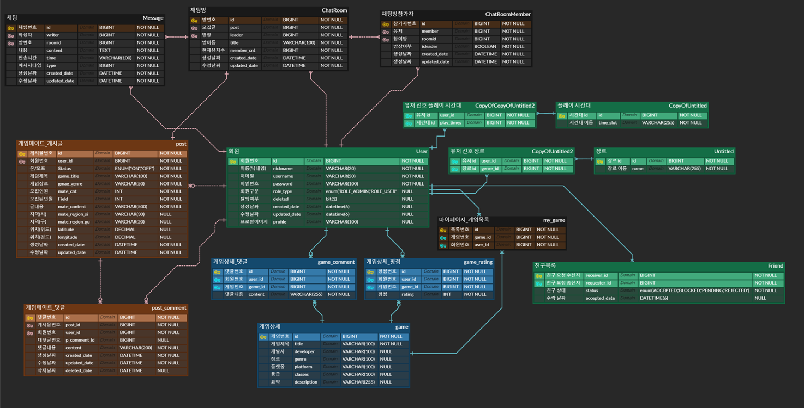
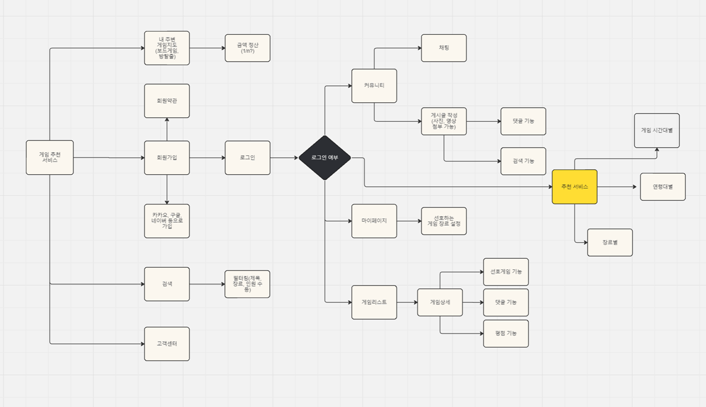
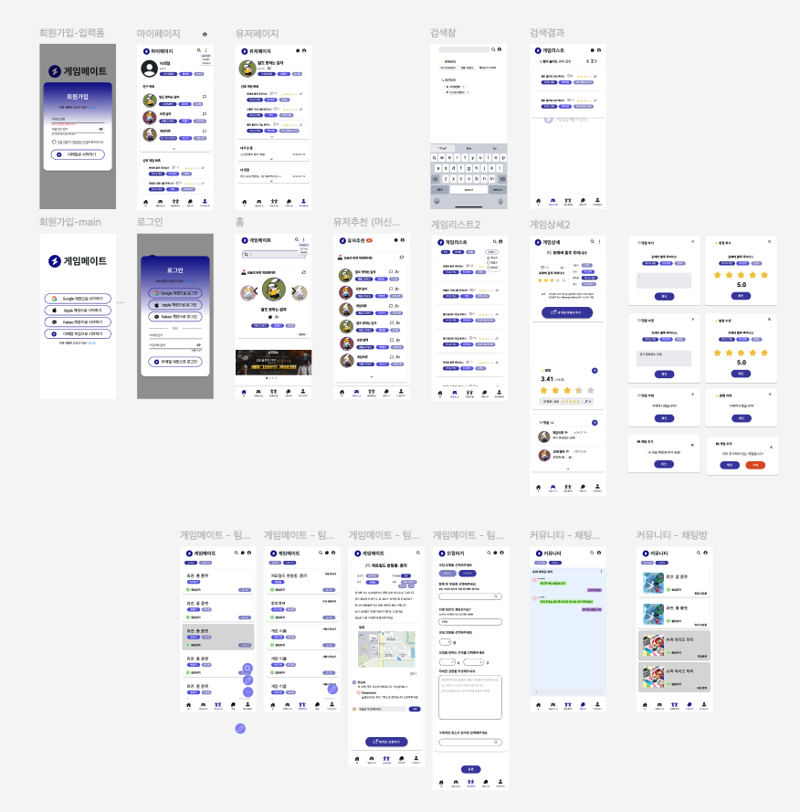

#  Gamemate 

***
## 개발 기간
 24.07.24 ~ 08.16

***
## 배포 주소

http://ec2-54-82-46-230.compute-1.amazonaws.com/

* * *
## 프로젝트 목적
* 유저가 다양한 게임 모임을 생성/참여하여 커뮤니티를 이룸
* 사용자가 선호 카테고리, 플레이 시간대를 선택하여 그것을 바탕으로 다른 유저를 추천함
* 채팅창을 통한 실시간 소통과 편리한 의사소통을 가능하게 함

***
## ERD

***
## FlowChart

***
### WireFrame

***
## 기술 스택

백엔드

프론트엔드

서버

ML

***
## Directory 구조 

    Backend
    .
    │  
    │  
    ├─main
    │  │  
    │  │  
    │  ├─java
    │  │  └─com
    │  │      └─example
    │  │          └─gamemate
    │  │              │  
    │  │              │  
    │  │              ├─domain
    │  │              │  ├─auth 
    │  │              │  ├─chat 
    │  │              │  ├─friend 
    │  │              │  ├─game
    │  │              │  ├─post
    │  │              │  ├─s3
    │  │              │  └─user
    │  │              │              
    │  │              └─global
    │  │                  ├─apiRes
    │  │                  ├─audit
    │  │                  ├─common
    │  │                  ├─config
    │  │                  ├─converter
    │  │                  ├─dataloader
    │  │                  ├─exception
    │  │                  ├─Interceptor
    │  │                  └─listener
    │  │                         
    │  │                          
    │  └─resources
    │              
    └─test

    Front
    src
    ├─ apis
    ├─ assets
    ├─ components
    ├─ hooks
    ├─ layouts
    ├─ pages
    ├─ utils
    ├─ App.css
    ├─ App.js
    ├─ App.test.js
    ├─ axiosInstance.js
    ├─ index.css
    ├─ index.js
    ├─ logo.svg
    ├─ reportWebVitals.js
    └─ setupTests.js

***
### 프로젝트 기능 명세

## 1. 유저 기능
* Spring Security + JWT 기반 사용자 인증/인가
* 회원
  * 회원 가입 시 비밀번호 암호화
  * 중복 이메일 불가
  * 선호 장르, 활동 시간대 설정
* 로그인
  * 로그인 시 Token 발급
* 마이 페이지
  * 마이 페이지를 통해 정보 수정 
  * 선호 게임, 내가 쓴 글 목록 확인 
  * 친구 요청과 보낸 친구 요청 관리
  * 회원 탈퇴 
## 2. 게임 리스트 기능
* 게임 리스트
  * 게임 정보를 API를 통해 가져와 DB에 저장
  * 플랫폼 별로 필터링 
  * 별점 순, 댓글 순으로 정렬 
  * 게임 제목 검색 
* 상세 페이지
  * 추가, 삭제 버튼을 이용하여 유저가 선호 게임으로 추가, 삭제 
  * 유저는 해당 게임의 평점을 게시할 수 있음
    * 평점을 게시하면 게시가 불가능해지고 수정, 삭제만 가능
  * 댓글
    * 댓글이 10개가 넘어가면 토글버튼을 클릭 후 확인 가능
## 3. 게시글 기능
  * 온라인, 오프라인 구분하여 글 작성
    * 오프라인은 지역을 선택 기능 추가
    * 지도를 통하여 원하는 장소 선택 
  * 상세 페이지
    * 댓글
      * 대댓글 가능
      * 원댓글을 삭제해도 대댓글이 삭제되지 않음
    * 신청
      * 신청 버튼을 통해 채팅방에 참여 가능
      * 방장에게만 신청 메세지가 보임
      * 방장이 수락하면 채팅방 멤버가 됨
## 4. 채팅 기능
* 채팅방은 본인이 방장이거나 멤버로 있는 채팅방만 표시
* 채팅
  * 최신 메세지를 보고 있을 경우 추가된 메세지가 바로 보임
  * 이전 메세지를 보고 있을 경우 새로운 메세지 알림 버튼을 클릭하여 최신 메세지로 이동
  * 데이터를 필요할 때 마다 가져오면서 무한 스크롤 구현
## 5. 관리자 기능
* google analytics 를 통해 접속자 수, 평균 참여 시간, 행동 등을 파악
## 6. 유저 추천 기능
* 토큰의 유저 정보를 가져와 선호 게임 장르와 플레이 시간대를 파이썬 서버로 전송
* DB에 저장되 있는 유저의 정보중 코사인 유사도가 높은 유저를 추출하여 프론트엔드로 전송

***
### API 명세서
http://ec2-54-82-46-230.compute-1.amazonaws.com:8080/swagger-ui/index.html

***
### 역할 분담

| | 이름  | 역할                                                     |
|---|-----|--------------------------------------------------------|
|  | 박원정 | 머신러닝 모델 및 전용 서버 구축 유저 관계 시스템(친구) 구현                |
| | 고의성 | 회원 인증/인가 처리                                            |
| | 김경래 | amazon s3을 이용한 프로필 이미지 설정 구현   google analytics 연동 |
|  | 김연지 | 게시글 CRUD 구현                                            |
|  | 김이삭 | 채팅 기능 구현                                               |
| | 조한휘 | 게임리스트 CRUD 구현       프론트 레이아웃 구현                    |

